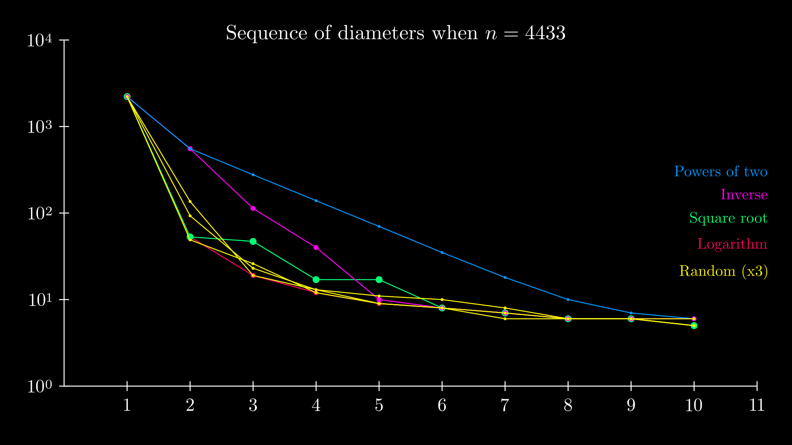

# NodeRank

Algorithm for ranking entries in a massive competition. See the [contributing](#contributing) section.

## Description

In a big competition context, a few judges cannot rank all the entries, we need a **peer review** algorithm.

Also, assigning an absolute number to an entry is quite hard, and we often need to reevaluate the number after judging a few entries. It is far easier to estimate whether an entry is better than another entry. This is why NodeRank uses **pairwise comparisons**, following other algorithms like [Gavel](https://www.anishathalye.com/2015/03/07/designing-a-better-judging-system/)

This way entries correspond quite naturally to the nodes of a directed graph where a comparison between two nodes is an arrow pointing to the better entry. The following algorithm describes how to construct this **comparison graph** and how to rank entries from this graph.

## Principles

We want the comparison graph to have the following properties:
1. It must be **connected**, since otherwise some islands of entries are not, even indirectly, comparable.
2. It should have the smallest **diameter** possible, otherwise if two entries are hundreds of comparisons apart, how to reliably tell which one is better?
3. Nodes must have the **same order**. This is a fairness principle. Every entry should receive the same amount of attention and have the same number of comparisons: it would not be fair if an entry were compared only once while another entry had dozens of comparisons. So we must have a **regular** graph.
4. Constructing the graph should be easy to scale up with more and more contributions (arrows) while keeping these four properties true.

Since we are talking about a peer review algorithm, these properties are realistic because the graph will have many times more arrows than nodes by asking competitors to each contribute a few comparisons.

### Ideal case

The best graph satisfying these properties is the **complete graph** which has diameter 1 with all nodes connected.

A complete graph with N nodes has $\frac{N(N-1)}{2}$ arrows so in practice we cannot expect to build this graph, since each of the N competitors would have to rank about $\frac{N-1}{2}$ entries, which in practice is way too much.

The principles above allow us to relax the constraints of a complete graph while keeping nice properties. Indeed the following algorithm creates a graph with N nodes whose diameter is exponentially decreasing after each iteration.

## Comparison graph

We can easily design a family of algorithms for building graphs with properties 1, 3 and 4 above. The idea is the following:

- Step 1: Connect all nodes in a cycle graph.
- Step k: Connect node i with node $F(N,k,i)$ for some function F of N (the size), k (the step) and i (the current node).

After step 1 all nodes have order 2 and there are N arrows. The diameter is $\mathrm{floor}(\frac{N}{2})$.

After step k all nodes have order $2k$ (F must be injective) and the graph has $kN$ arrows. The diameter at step k depends on the chosen function F, so we need to perform a benchmark to find the best function possible.

A simple family of such functions is $F(N,k,i) = i + f(N,k)$ for f based on usual functions like $\frac{N}{k}$ or $\frac{N}{2^k}$ etc. The video below shows the steps when $f(N,k) = \mathrm{ceil}(\frac{N}{2^k})$

https://user-images.githubusercontent.com/48696601/186481367-c9e00009-77ee-4439-a22a-63dd4cd15114.mp4

## Research question

Answering the following open question would help make a big leap toward finding a canonical way to build the graph:

> What is the 2k-regular graph of order N of smallest diameter?

Since we lack a canonical way to build the graph, we can benchmark different strategies to find the best one.

## Benchmark

When comparing two strategies F1 and F2 for building the comparison graph, let's say F1 is **strongly** better than F2 if at **every** step of the algorithm, the diameter given by strategy F1 is less than or equal to the one given by strategy F2. Let's say it's **weakly** better if on average more steps are in favor of F1 than F2.

For the benchmark, we've looked at the first 10 iterations of the algorithm, on random samples of graphs of order between 100 and 10000.

The different strategies benchmarked are:
- Powers of two: based on $f(N,k)=\frac{N}{2^k}$
- Inverse: based on $f(N,k)=\frac{N}{1+k}$
- Square root: based on $f(N,k)=\frac{N}{1+\sqrt{k}}$
- Logarithm: based on $f(N,k)=\frac{N}{2+\log{k}}$
- Random:  choose a random integer between 2 and N//2 and use it for all pairings at step k. Make sure the function is injective so do not reuse integers.

You can run the benchmarks with `python -m scripts.benchmark`. See `benchmark.py` for the exact implementations.

### Example

This is the decrease in diameter for the different strategies when $n=4433$, showing an exponential decrease of the diameter in a log scale.

  

After 8 steps with the log strategy, the graph has diameter 6.

### Results

When N is big enough there is a clear difference between the strategies:

- The inverse strategy is strongly better than the power of two strategy in 100% of samples
- The square root strategy is weakly better than the inverse strategy 82% of the time
- The log strategy is weakly better than the square root strategy 76% of the time
- The random strategy is almost always as good as the log strategy.

### Conclusion

The **random strategy** stands out for the following reasons:
1. It performs consistently well, like the log strategy
2. The formula is simple and more canonical than the others
3. It's the only one that converges to the **complete graph** of order N (in $k=\frac{N-1}{2}$ steps). The other strategies stop after connecting nodes closer and closer until i and i+1

## Naive ranking

A naive way to select the best nodes would be to pick the ones with the most wins.

https://user-images.githubusercontent.com/48696601/194752506-684f09a1-525d-4d52-aeeb-14a646df92fa.mp4

It's easier to win against a competitor who lost all his comparisons than it is to win against a competitor who wins most of his comparisons. So it's not enough to count the number of wins. We must take into account the relative strength of the losing nodes.

## NodeRank

All nodes start with 1 point, so there are N points in the graph. This is a constant (the sum of all points) but points will flow in the graph: at each step, the points of a given node are divided among its outgoing arrows. So a node who lost 10 out of 10 comparisons will only contribute 0.1 points to each winner. This node tends to lose often so it's not so meaningful to win against it. On the contrary, a node that only lost one out of 10 comparisons will contribute one point to the winner. It means a lot more to win against this node.

We apply this procedure $\mathrm{diam}(G)$ times (the diameter of the graph) to allow the information to flow between any two nodes of the graph. This way we get a more faithful representation of the value of nodes. The best ones are the ones with the most points after $\mathrm{diam}(G)$ steps of this procedure.

https://user-images.githubusercontent.com/48696601/194753795-f6d8412d-0606-4194-9da3-c4530739ee48.mp4

### Complexity

- At step $k$ the judge i must compare nodes i and $i+f(N,k)$, so knowing what the next judge should do is $O(1)$.
- After $k$ steps the graph consists of $kN$ arrows and to compute the winners we need to flow points $\mathrm{diam}(G)$ times along these edges so the complexity of the ranking is $O(N)$

## Contributing

If you would like to contribute, improve the algorithm/explanations/graphics, make a suggestion, or correct a typo, you are welcome to send a pull request!

## License

[MIT](LICENSE)
