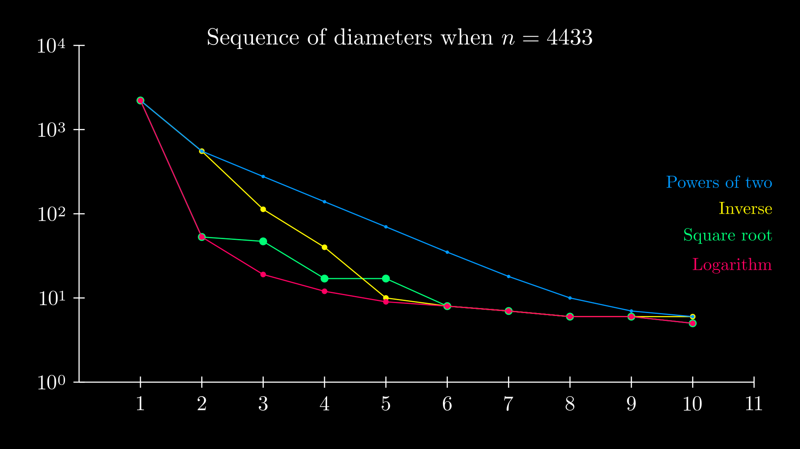

# NodeRank+

Here I propose an algorithm for massive competion judging. See the [contributing](#contributing) section.

In a big competition context, a few judges cannot rank all the entries, so we need a **peer review** algorithm.

Also, assigning an absolute number to an entry is quite hard, and we often need to reevaluate the number after judging a few entries. It is far easier to estimate whether an entry is better than another entry. So the ranking will be based on **pairwise comparisons**, following other algorithms like [Gavel](https://www.anishathalye.com/2015/03/07/designing-a-better-judging-system/)

In this way entries correspond quite naturally to the nodes of a directed graph where a comparison between two nodes is an arrow pointing to the better entry. The algorithm needs to describe how to construct this **comparison graph** and how to rank entries from this graph.

## Principles

We want the comparison graph to have the following properties:
1. It needs to be **connected**, since otherwise some islands of entries are not, even indirectly, comparable.
2. It needs to have the smallest **diameter** possible. Information quality decreases over long distances, so if two entries are hundreds of comparisons appart, how to reliably tell which one is better?
3. Nodes need to have the **same order**. This is a fairness principle. Every entry should receive the same amount of attention and have the same number of comparisons: it would not be fair if an entry were compared only once while another entry had dozens of comparisons.
4. Constructing the graph should be easy to scale up with more and more contributions (arrows) while keeping these four properties true.

Since we are talking about a peer review algorithm, these properties are realistic because the graph will have many times more arrows than nodes by asking competitors to each contribute a few comparisons.

### Ideal case

The best graph satisfying these properties is the **complete graph** which has diameter 1 with all nodes connected.

A complete graph with N nodes has $\frac{N(N-1)}{2}$ arrows so in practice we cannot expected to construct this graph, since each of the N competitors would need to rank about $\frac{N-1}{2}$ entries which in pratice is way too much.

So the principles above allow to relax the constaints of a complete graph, while keeping nice properties. Indeed the following algorithm creates a graph with N nodes whose diameter is exponentially decreasing after each iteration.

## Comparison graph

We can easily design a family of algorithms building graphs with properties 1, 3 and 4 above. The idea is the following:

- Step 1: connect all nodes in a cycle graph.
- Step k: connect node i with node $F(N,k,i)$ for some function F of N, k and i.

After step 1 all nodes have order 2 and there are N arrows. The diameter is $\mathrm{floor}(\frac{N}{2})$.

After step k all nodes have order $2k$ ($F$ must be injective) and the graph has $kN$ arrows. The diameter at step k depends on the chosen function F, so we need to perform a benchmark to find the best function possible.

A simple family of such functions is $F(N,k,i) = i + f(N,k)$ for f based on usual functions like $\frac{N}{k}$ or $\frac{N}{2^k}$ etc. The video below shows the construction steps when $f(N,k) = \mathrm{ceil}(\frac{N}{2^k})$

https://user-images.githubusercontent.com/48696601/186481367-c9e00009-77ee-4439-a22a-63dd4cd15114.mp4

## Benchmark

When comparing two strategies F1 and F2 for building the comparison graph, let's say F1 is **strongly** better that F2 if at **every** step of the algorithm, the diameter given by strategy F1 is less than or equal to the one given by strategy F2. Let's say it's **weakly** better if on average more steps are in favor of F1 rather than F2.

For the benchmark I've looked at the first 10 iterations of the algorithm, on random samples of graphs of order between 100 and 10000.

The different stategies benchmarked are:
- Powers of two: based on $f(N,k)=\frac{N}{2^k}$
- Inverse: based on $f(N,k)=\frac{N}{1+k}$
- Square root: based on $f(N,k)=\frac{N}{1+\sqrt{k}}$
- Logarithm: based on $f(N,k)=\frac{N}{2+\log{k}}$

You can run the benchmarks with `python -m scripts.benchmark`. See `benchmark.py` for the exact strategies implementation

### Results

When N is big enough there is a clear difference between the strategies:

- The inverse strategy is strongly better than the power of two strategy in 100% of samples
- The square root strategy is weakly better than the inverse strategy 82% of the time
- The log strategy is weakly better than the square root strategy 76% of the time

## Example

This is the decrease of diameters for the different strategies when $n=4433$

  

After 8 steps with the log strategy the graph has order 6.

Notice we can easily model the probabilities of the number of wins for a given node with a binomial distribution with parameters $n=2$ and $p=\frac{1}{2}$. This will nicely generalize in the next steps.

## Naive ranking

A naive way to select the best nodes would be to pick the ones with the most wins.

Following the previous example, after step 9 each node has order 10 and the probability for a given node to win 9 or 10 over 10 comparisons is, using a binomial distribution with parameters $n=10$ and $p=\frac{1}{2}$:

$$
\frac{1}{2^{10}}\left(\binom{10}{9}+\binom{10}{10}\right)=\frac{11}{2^{10}}
$$

So in a competition with $2^{10}$ competitors this would select about 11 entries.

But it's easiser to win against a competitor who lost all his comparisons that to win against a competitor who wins most his comparisons. So it's not enough to count to number of wins. We must take into account the relative strength of the loosing nodes.

## NodeRank

All nodes start with 1 point, so there are N points in the graph. This is a constant (the sum of all points) but points will flow in the graph: at each step the points of a given node are divided among its outgoing arrows. So a node who lost 10 out of 10 comparisons will only contribute 0.1 point to each winner. This node tends to lose often so it's not so meaningul to win against it. On the contrary a node who only lost one out of 10 comparisons will contribute one point to the winner. It means a lot more to win against this node.

We apply this procedure $\mathrm{diam}(G)$ times (the diameter of the graph) to allow the information to flow between any two nodes of the graph. This way we get a more faithful representation of the value of nodes. The best ones are the ones with more points after $\mathrm{diam}(G)$ steps of this procedure.

The name is inpired from the PageRank algorithm. But there is more in the next section. As-is this algorithm promotes nodes with many wins against nodes with many wins themselves. But couldn't it be that a node only happened to be compared to weaker entries, while still being a very good entry ? This kind of node would be stuck with only a few points while still being a very good entry.

It would be nice to avoid this situation by design while keeping the other properties.

### Complexity

- At step $k$ the judge i must compare nodes i and $i+\frac{N}{2^{k-1}}$, so knowing what the next judge should do is $O(1)$.
- After $k$ steps the graph consists of $N+(k-1)\frac{N}{2}$ arrows and to compute the winners we need to flow points $\mathrm{diam}(G)$ times along these edges so the complexity is $O(Nk)$

## NodeRank+

Coming soon!

## Contributing

If you would like to make a suggestion, correct a typo or improve the algorithm/explanation/graphics, you can send a pull request, they are welcome !

## License

[MIT](LICENSE)